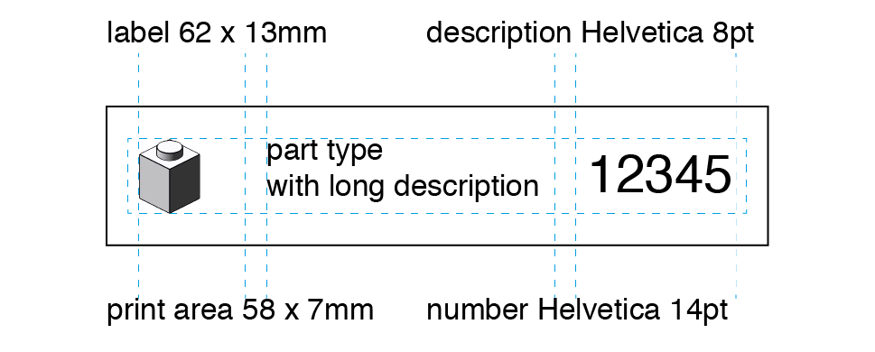

# BrickVentory Labels

This is a modified version of the labels from the [LEGO Brick labels at brickarchitect.com](http://http://brickarchitect.com/labels/).

- designed for Brother labels printer and the P-Touch software
- format 62 x 13mm
- folder organization according to [BrickLink catalog categories](http://www.bricklink.com/catalogTree.asp?itemType=P)

## Label Size

## Image creation

Use the `makebrickimage.sh` script located at `/bin`. It uses the ldraw library and the ldview programm.

## Contribution

Use the `label-template.lbx` file to generate a new label. The new file name should follow the `$elementNumber-$elementName{-$elementColor}.lbx`format.

## References

[LDView project page](https://tcobbs.github.io/ldview/)

[LDView help](https://trevorsandy.github.io/lpub3d/assets/docs/ldview/Help.html)

List of available [command line options for LDView](https://trevorsandy.github.io/lpub3d/assets/docs/ldview/Help.html#CommandLinePrefs).
