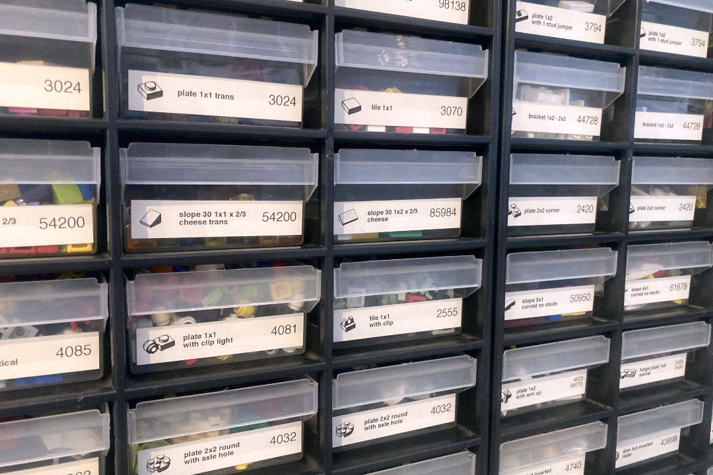
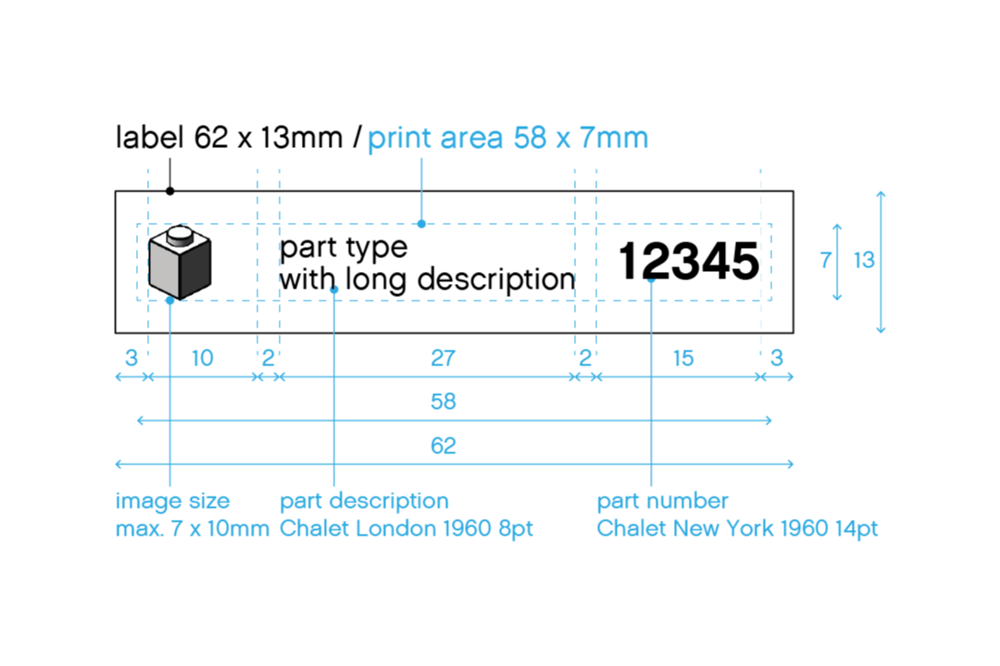

# BrickVentory Labels

This is a modified version of the labels from the [LEGO Brick labels at brickarchitect.com](https://brickarchitect.com/labels/).

- using the open SVG format for easier editing of labels
- exported PDF labels for easier printing
- format 62 x 13mm -> these fit onto the Aldi small drawer boxes
- folder organization according to [BrickLink catalog categories](http://www.bricklink.com/catalogTree.asp?itemType=P)

## Contribution

Use the `labels_62x13_all.svg` file to add a new label to the document. This document uses a unique feature of the Free and open source vector graphics editor [Inkscape](https://inkscape.org) to place multiple pages in a single SVG file. If necassary create a new image for a lego piece using the `/bin/makebrickimage.sh` script.

Export the single label page to a PDF and sort it into the appropriate folder under `/labels`. The new PDF file name should follow the `$elementNumber_$elementName{ $elementColor}.pdf` naming pattern.

## Label Size and Fonts

The labels use the **Chalet London 1960** and **Chalet New York 1960** fonts, which are the fonts used on the original LEGO boxes. You can find the font files in the `/font` folder.
## Image creation

Use the `makebrickimage.sh` script located in the `/bin` folder. It uses the Ldraw library and the ldview programm.

## References

[LDraw](https://ldraw.org) - open standard library for LEGO CAD programs

[LDView project page](https://tcobbs.github.io/ldview/) - real-time 3D viewer for displaying LDraw models

[LDView help](https://trevorsandy.github.io/lpub3d/assets/docs/ldview/Help.html)

List of available [command line options for LDView](https://trevorsandy.github.io/lpub3d/assets/docs/ldview/Help.html#CommandLinePrefs)

[Inkscape](https://inkscape.org) - a free and open source vector graphis editor
